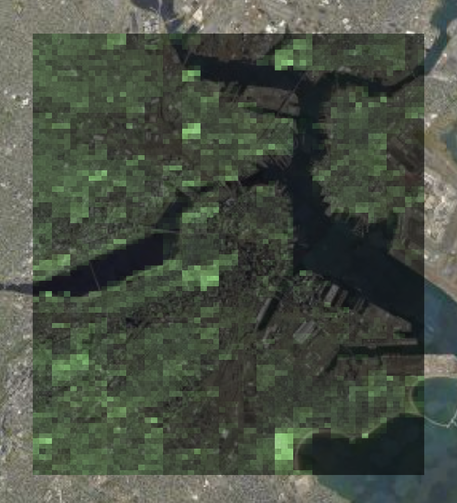

# GreenView

GreenView is an easy tool that identifies and displays greenery in a city and maps it out, making it easier for cities to prioritize adding green spaces where they are most needed.

[Devpost](https://devpost.com/software/greenview) | [Website Interface](https://crowb.ar)

## Inspiration

We did a lot of thinking about what would improve life in urban areas and a huge component we came up with is green spaces. Urban areas can be incredibly short on green spaces - big cities often have just one big park in the center. We wanted to come up with a way for cities to figure out where best to put green spaces.

## What it does

GreenView visualizes the green spaces in cities as varying levels of brightness of green overlayed on a satellite map. It's easy for a user to see what parts of the city are short on green spaces and could use more. A government official could use our tool to plan out their vision of a greener city so that everyone has equal access to green spaces.

## How we built it

We built a process in using Playwright and Pillow in Python which scrapes satellite images and analyzes them to determine how much greenery is in each image. We then overlay a grid of these analyses over another map using Leaflet.js.

## Challenges we ran into

We spent a while in the early stages of our project attempting to use a pre-trained model to identify and count trees in the images. We tested that approach versus our traditional color analysis approach (which looks at hue, saturation, and value of the color of a pixel) and we found that the ML approach actually fell short. We ended up going completely with the color analysis approach, which did a similar (and slightly better) job of finding trees and was much better at detecting grass. Its only downside is that it gets a slightly higher rate of false positives (for example greenish water being identified as greenery). Another challenge we ran into was on a version of our project where we attempted to use a JavaScript-based filter to filter greens and display in a similar way to our final product. This implementation had really slow load times and wasn't as accurate so we scrapped it. We also struggled to learn and manage the combination of latitude and longitude coordinates and meter distances to have our map subsections line up correctly.

## Accomplishments that we're proud of

We're incredibly proud that we managed to get GreenView from an empty repository to a working demo of Boston in less than 24 hours. We focused on creating a fresh new tool that would have real-world use cases and we believe we succeeded. We're also proud of how good we managed to get our green detection to be.

## What we learned

We learned a ton about web scraping from using Playwright to take hundreds of screenshots of satellite photos, image composition and analysis from using Pillow to figure out what parts of images were green, and coordinate systems from managing latitude and longitudes as well as distances to make our images line up cleanly.

## What's next for GreenView

GreenView has more to go. We want to implement a user interface to allow a visitor to the website to click somewhere on a world map and see a GreenView grid appear around their click. With this, we will expand from displaying one city to displaying anywhere the user wants, greatly improving our range of impact.

